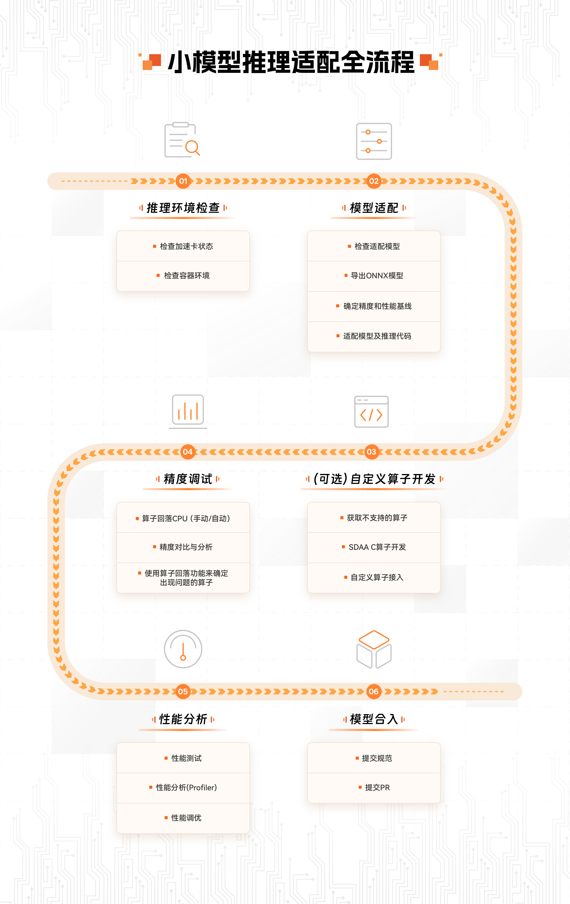

# TecoInferenceEngine

## 介绍

TecoInferenceEngine（小模型）是基于太初加速卡特性研发的高性能推理加速引擎，基于AI编译技术，提供高效的小模型推理解决方案，并针对分类、检测、分割、自然语言处理、语音等场景常用的各类经典和前沿的AI模型提供适配支持。

## 模型适配全流程

您可以将各类模型迁移到本仓库进行推理。适配流程图如下：

详细信息，请参考[模型适配指南](./doc/模型适配指南.md)。

## 模型推理开发示例

| 模型                                                | 类型 | 精度类型 | 推理卡数 |
| --------------------------------------------------- | ---- | -------- | -------- |
| [RESNET](./example/classification/Resnet/README.md) | 分类 | FP16     | 单卡     |

## 免责声明

TecoModelZoo仅提供公共数据集的下载链接。这些公共数据集不属于TecoModelZoo, TecoModelZoo也不对其质量或维护负责。请确保您具有这些数据集的使用许可。确保符合其对应的使用许可。

如果您不希望您的数据集公布在TecoModelZoo上或希望更新TecoModelZoo中属于您的数据集，请在Github/提交issue,我们将根据您的issue删除或更新您的数据集。衷心感谢您对我们社区的理解和贡献。

## 许可认证

TecoModelZoo的license具体内容，请参见[LICENSE](../LICENSE)文件。
